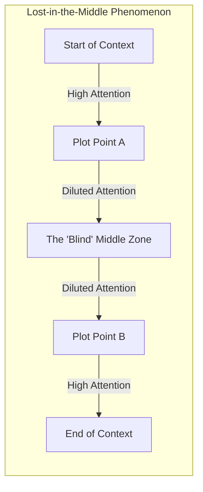

# Video Script: Deep Dive into Context Management (Long Form - 4 mins)

**Topic:** Context Windows & Narrative Pacing
**Target Audience:** Software Developers

---

## 0:00 - 0:45 | Introduction: The Illusion of Infinite Memory
- **Script:**
  > "We've all seen the headlines—millions of tokens of context. But as developers, we know that raw capacity doesn't equal intelligence. In the world of AI Video generation, where every 8 seconds of video depends on the previous 80 minutes of story, a floating window just doesn't cut it. Welcome to a deep dive into Context Management for Narrative-to-Video."

## 0:45 - 2:00 | The Problem: Context Rot & Lost-in-the-Middle
- **Script:**
  > "Why does an LLM fail when you provide too much data? It's not just about token limits. It's about 'Attention'. In long sequences, the self-attention mechanism becomes diluted. This leads to **Context Rot**—where subtle details, like a character's limp introduced in Chapter 1, get drowned out by Chapter 10. We call this the 'Lost-in-the-Middle' phenomenon. For a video pipeline, this manifests as visual hallucinations: a character suddenly changing clothes or a sword disappearing between shots."

## 2:00 - 3:30 | The Architecture: Continuum Flow & Hierarchical Summarization
- **Script:**
  > "So, how does Continuum Flow solve this? We implement a **Hierarchical Recursive Summarization Architecture**. Instead of a sliding window that drops old tokens, we actively synthesize the story. 
  > 
  > Level 0 is our **Working Window**—raw, high-resolution text for the current scene. 
  > Level 1 holds **Scene Summaries**—factual captures of what just happened. 
  > Level 2 and 3 form the **Narrative Backbone**. 
  > 
  > Think of it as a 'Telescoping' context. We have high detail for what's happening *now*, and compressed, structural knowledge of everything that happened *before*. This ensures that if a character is wounded in the beginning, the 'Backbone' carries that state forever, regardless of how many tokens pass."

> [!TIP]
> By treating the novel as a State Machine rather than a text stream, we maintain 100% visual continuity with 70% fewer tokens.

## 3:30 - 4:00 | Implementation & Developer Insight
- **Script:**
  > "This is the difference between an AI that 'reads' and an AI that 'understands' a story arc. Head over to our `/docs` to explore the Narrative AST implementation."

---

## Technical Glossary
- **Hierarchical Summarization:** A technique where information is compressed into multiple levels of detail to optimize context usage.
- **Narrative Backbone:** The persistent long-term memory of a story state in the Continuum Flow architecture.
- **Context Rot:** The degradation of information quality as more tokens are added to a model's context.
