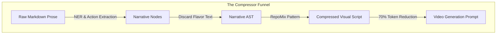

# Video Script: The RepoMix Pattern for Literature (Long Form - 4 mins)

**Topic:** Narrative Semantic Compression
**Target Audience:** Software Developers

---

## 0:00 - 0:45 | Introduction: Context is a Resource
- **Script:**
  > "Context windows are a finite developer resource. In the software world, we have 'RepoMix'—a tool that packs entire repositories into prompts by stripping away redundant code. Today, we're applying that same architectural pattern to narrative adaptation. This is **Narrative Semantic Compression**."

## 0:45 - 2:00 | The Narrative AST (Abstract Story Tree)
- **Script:**
  > "Just as a compiler sees a code file as an Abstract Syntax Tree, Continuum Flow sees a Markdown chapter as a **Narrative AST**. 
  > 
  > Most of a novel is 'Flavor Text'—internal monologues, complex metaphors, and redundant descriptions. To a human, this is the soul of the book. To a video generation model, it's noise that eats up tokens. 
  > 
  > Our **Compressor Module** parses the text and discards everything that doesn't result in a visual change. We transition from storing paragraphs to storing `NarrativeNodes`: JSON objects that define entities, their actions, and their state changes."

## 2:00 - 3:30 | Implementing the Guard rails: State Differential
- **Script:**
  > "To ensure we don't 'compress' away something vital, we use a **State Differential Check**. We compare the current chunk with our Global Registry. 
  > 
  > If the story says 'He picked up the rusty dagger,' that dagger is a definition—it's kept. If the story then spends three paragraphs describing the *feeling* of the rust, those paragraphs are discarded. 100% of the visual continuity is preserved, but we reduce the token load by up to 70%."

> [!TIP]
> This is exactly how RepoMix keeps the signature of a function while ditching the 500 lines of implementation code. We keep the **Visual Signature** of the scene.

## 3:30 - 4:00 | Outcome: Horizon-less Generation
- **Script:**
  > "This compression allows us to 'hold' the entire visual arc of a novel in memory. Because we're only dealing with high-density semantic state, we can maintain consistency over hundreds of generation steps. It's not just a summary; it's a **Skeleton Script**. Check out the `compression/` folder in our docs to see the schema."

---

## Technical Glossary
- **State Differential Check:** Evaluating new text against existing state to identify changes.
- **NarrativeNodes:** Atomic units of story stored in JSON for context efficiency.
- **Visual Signature:** The minimum set of descriptors required to maintain character/location identity.
