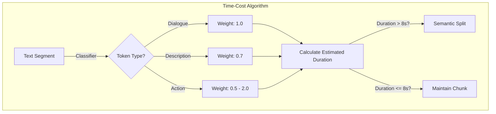

# Video Script: The Math of Cinematic Pacing (Long Form - 4 mins)

**Topic:** Semantic Content Chunking
**Target Audience:** Software Developers

---

## 0:00 - 0:45 | Introduction: The Temporal Void
- **Script:**
  > "When you read a book, the pace is in your head. But when you generate a video, the pace is in the frames. Most AI video models today fail after 10 seconds of continuous generation. To adapt a 100,000-word novel, we have to solve the **Temporal-Textual Conversion Problem**. Today, we're looking at Semantic Chunking."

## 0:45 - 2:00 | The Time-Cost Algorithm
- **Script:**
  > "How long does a sentence take to 'happen'? We can't just count words. We use a weighted heuristic. 
  > 
  > **Dialogue** is base-line (approx. 2.3 words per second). 
  > **Descriptive Prose** gets a 0.7x multiplier because visuals are processed faster than text. 
  > **Action** is variable. 'He ran across the field' is faster than 'He waited for the dawn'."

## 2:00 - 3:30 | Atomic Scenes & High-Entropy Cuts
- **Script:**
  > "A movie isn't just a sequence of clips; it's a flow. To maintain engagement, we use **Micro-Cliffhanger Heuristics**. The chunker avoids ending on a 'dead beat' like a period or a fade-out unless the chapter is over. 
  > 
  > Instead, it looks for 'High Entropy' tokens—words that imply unresolved action. This mimics a cinematic 'Shot-Reverse-Shot'. When Clip A ends on a point of tension, Clip B resolves it. This 'Atomic Scene' logic bridges the technical 8-second gap."

> [!TIP]
> By using high-entropy cuts, we make the viewer forget they're watching a sequence of discrete generated segments.

## 3:30 - 4:00 | Audio-Visual Synchronization
- **Script:**
  > "Critically, this strategy drives the **Audio-Visual Split**. We ensure that any dialogue in a chunk doesn't outrun the visual duration. If a character has a long speech, the chunker automatically splits the visuals into Part A and B while keeping the audio stream continuous. This is pacing as a service. Explore our `chunking_strategy.py` to see how we balance time and prose."

---

## Technical Glossary
- **Temporal-Textual Conversion:** The algorithmic process of estimating visual duration from written text.
- **Audio-Visual Split:** Parallel processing of text for video generation and text-to-speech synchronization.
- **Semantic Units:** The smallest independent chunks of meaning (sentences, dialogue lines) used as building blocks.
